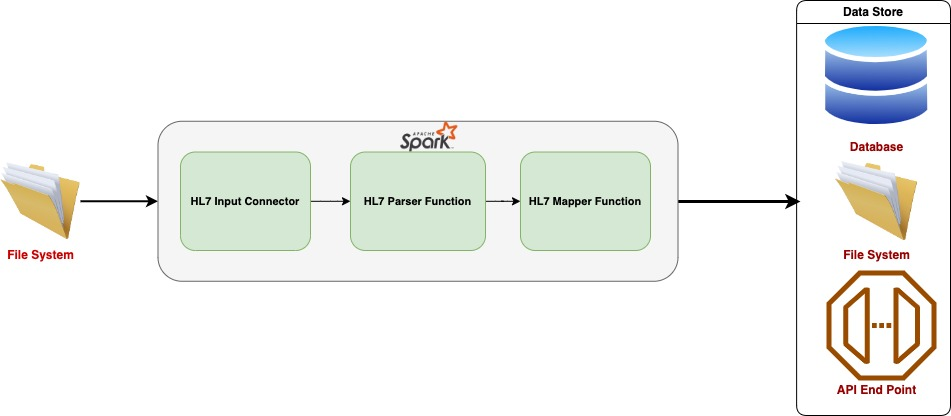

# Spark-based Generic HL7 Parser
## POC Introduction:
The purpose of this POC is to develop a Spark-based generic HL7 parser that can support parsing HL7 messages in any format and convert the parsed data into a user-specified JSON format. This solution will enable healthcare organizations to efficiently process and extract valuable insights from HL7 data by leveraging the power of Apache Spark.

## POC Scope:
The parser will support parsing HL7 messages of various formats, including HL7 v2.x. The solution will be implemented using Apache Spark, utilizing its distributed processing capabilities for handling large volumes of HL7 data.

## Functional Requirements:
1. Parse HL7 Messages: The parser should be able to parse HL7 messages in different formats, including support for various HL7 versions and segments.
2. Validation: The system should perform basic validation checks on the HL7 messages to ensure data integrity.
3. Transformation: The parsed HL7 data should be transformed into a user-specified JSON format.
4. Performance: The system should be capable of processing HL7 messages efficiently, meeting defined performance benchmarks.

## Architecture and Design:
The system will follow a distributed architecture leveraging Apache Spark. The HL7 parser module will receive input HL7 files from various source such as local,HDFS,s3,SFTP,FTP,S3,Azure Blob storage and Azure Data Lake Storage Gen2, which will be processed in parallel by Spark workers. The parsed data will be transformed into a user-specified JSON format using Spark's data manipulation capabilities.


## Demo of our Spark-based generic HL7 parser:
1. Here's a sample HL7 message in version 2.5 format.
```text
MSH|^~\&|^^|MA0000^^|^^|GA0000^^|20111105122535||RSP^K11^RSP_K11|1320521135996.100000002|T|2.5.1|||||||||Z32^CDCPHINVS^^|
MSA|AA|19970522GA40||
QAK|||Z34^RequestImmunizationHistory^HL70471|
QPD|Z34^RequestImmunizationHistory^HL70471|19970522GA05||FLOYD^FRANK^^^^^L|MALIFICENT|20030123|M|L|
PID|1||25^^^^SR~0001||FLOYD^FRANK^^^^^L||20030123|M|||612SWRIGHTCT^^KENNEWICK^WASHINGTON^99366^UnitedStates^M||(509)421-0355^^PH^^^509^4210355^|||||||||||||||||N|
PD1|||^^^^^^SR|21^MATT^SHAKY^K^^^^^^^^^SR~1679652135|||||||02^Reminder/recall-anymethod^HL70215|||||A^Active^HL70441|
NK1|1|FLOYD^MALIFICENT|GRD^Guardian^HL70063|
PV1||R|
ORC|RE||25.34.20100723|
RXA|0|999|20120727112142|20120727112142|998^novaccineadministered^CVX|0||||||||||||||||20120727112144|
OBX|1|CE|30956-7^vaccinetype^LN||0^DTP/aP^CVX||||||F|
OBX|1|CE|59779-9^ImmunizationScheduleused^LN||VXC16^ACIP^CDCPHINVS||||||F|
OBX|1|NM|30973-2^Dosenumberinseries^LN||4||||||F|
OBX|1|TS|30980-7^Datevaccinationdue^LN||20121206||||||F|
OBX|1|TS|30981-5^Earliestdatetogive^LN||20121206||||||F|
OBX|1|TS|59777-3^Latestdatenextdoseshouldbegiven^LN||20161101||||||F|
OBX|1|TS|59778-1^Datedoseisoverdue^LN||20130106||||||F|
OBX|1|CE|59783-1^Statusinimmunizationseries^LN||U^UptoDate^STC0002||||||F|
ORC|RE||9999|
```
2. Sample HL7Parser Output:
```json5
{
  "MSH": {
    "MSH_1": "|",
    "MSH_2": "^~\\&",
    "MSH_4": {
      "HD_1": "MA0000"
    },
    "MSH_6": {
      "HD_1": "GA0000"
    },
    "MSH_7": {
      "TS_1": "20111105122535"
    },
    "MSH_9": {
      "MSG_1": "RSP",
      "MSG_2": "K11",
      "MSG_3": "RSP_K11"
    },
    "MSH_10": "1320521135996.100000002",
    "MSH_11": {
      "PT_1": "T"
    },
    "MSH_12": {
      "VID_1": "2.5.1"
    },
    "MSH_21": {
      "EI_1": "Z32",
      "EI_2": "CDCPHINVS"
    }
  },
  "MSA": {
    "MSA_1": "AA",
    "MSA_2": "19970522GA40"
  },
  "QAK": {
    "QAK_3": {
      "CE_1": "Z34",
      "CE_2": "Request Immunization History",
      "CE_3": "HL70471"
    }
  },
  "QPD": {
    "QPD_1": {
      "CE_1": "Z34",
      "CE_2": "Request Immunization History",
      "CE_3": "HL70471"
    },
    "QPD_2": "19970522GA05",
    "QPD_4": {
      "UNKNOWN_1": "FLOYD",
      "UNKNOWN_2": "FRANK",
      "UNKNOWN_7": "L"
    },
    "QPD_5": "MALIFICENT",
    "QPD_6": "20030123",
    "QPD_7": "M",
    "QPD_8": "L"
  },
  "PID": {
    "PID_1": "1",
    "PID_3": {
      "CX_1": "0001"
    },
    "PID_5": {
      "XPN_1": {
        "FN_1": "FLOYD"
      },
      "XPN_2": "FRANK",
      "XPN_7": "L"
    },
    "PID_7": {
      "TS_1": "20030123"
    },
    "PID_8": "M",
    "PID_11": {
      "XAD_1": {
        "SAD_1": "612 S WRIGHT CT"
      },
      "XAD_3": "KENNEWICK",
      "XAD_4": "WASHINGTON",
      "XAD_5": "99366",
      "XAD_6": "United States",
      "XAD_7": "M"
    },
    "PID_13": {
      "XTN_1": "(509)421-0355",
      "XTN_3": "PH",
      "XTN_6": "509",
      "XTN_7": "4210355"
    },
    "PID_30": "N"
  },
  "PD1": {
    "PD1_3": {
      "XON_7": "SR"
    },
    "PD1_4": {
      "XCN_1": "1679652135"
    },
    "PD1_11": {
      "CE_1": "02",
      "CE_2": "Reminder/recall -any method",
      "CE_3": "HL70215"
    },
    "PD1_16": "A"
  },
  "NK1": {
    "NK1_1": "1",
    "NK1_2": {
      "XPN_1": {
        "FN_1": "FLOYD"
      },
      "XPN_2": "MALIFICENT"
    },
    "NK1_3": {
      "CE_1": "GRD",
      "CE_2": "Guardian",
      "CE_3": "HL70063"
    }
  },
  "PV1": {
    "PV1_2": "R"
  },
  "ORC": {
    "ORC_1": "RE",
    "ORC_3": {
      "EI_1": "9999"
    }
  },
  "RXA": {
    "RXA_1": "0",
    "RXA_2": "999",
    "RXA_3": {
      "TS_1": "20120727112142"
    },
    "RXA_4": {
      "TS_1": "20120727112142"
    },
    "RXA_5": {
      "CE_1": "998",
      "CE_2": "no vaccine administered",
      "CE_3": "CVX"
    },
    "RXA_6": "0",
    "RXA_22": {
      "TS_1": "20120727112144"
    }
  },
  "OBX": {
    "OBX_1": "1",
    "OBX_2": "CE",
    "OBX_3": {
      "CE_1": "59783-1",
      "CE_2": "Status in immunization series",
      "CE_3": "LN"
    },
    "OBX_5": {
      "CE_1": "U",
      "CE_2": "Up to Date",
      "CE_3": "STC0002"
    },
    "OBX_11": "F"
  }
}
```
3. Here's our Sample Mapping JSON
```json5
{
  "patientIdentification": {
    "full_name": "trim(concat_ws('',[PID.PID_5.XPN_2],[PID.PID_5.XPN_1.FN_1]))",
    "col": "IF([PID.PID_5.XPN_777]ISNULL,100,200)",
    "CE": "IF([PD1.PD1_11.CE_18888]ISNULL,'10000',[PD1.PD1_11.CE_18888])",
    "address": {
      "street": "IF([PID.PID_11.XAD_1.SAD_1]ISNULL,[PID.PID_11.XAD_3],[PID.PID_11.XAD_1.SAD_1])",
      "Country": "USA",
      "pinCode": 100,
      "isUsa": true,
      "county": [
        {
          "state": "[PID.PID_11.XAD_1.SAD_19898]",
          "zipcode": ""
        }
      ]
    }
  }
}
```
4. Output Data


### Example Code
```scala
import com.parser.{Hl7Connector, Hl7Mapper}
import org.apache.spark.sql.SparkSession

object Main extends Hl7Connector with Hl7Mapper {
  def main(args: Array[String]): Unit = {

    val spark = SparkSession.builder().master("TEST")
      .master("local[*]").getOrCreate()
    val sourceFileSystem = Some("sftp")
    val sourceSystem = Some(Map("username" -> "srini",
      "password" -> "smartek", "host" -> "localhost",
      "port" -> "9922"))
    // /foo-home/hl7/501
    val options: Map[String, String] = Map("hl7schema" ->
      "H4sIAAAAAAAAAGWQUW+CMBDHP4Hf4Z72tqYF3TsqCokKKbjpspRU6JQEqYGyaHLZZ19xPmj8p2mvl/v/etdlEqD4/XrBpZ94GY/TbDnn6HtJmnFvGkaLaL7FcvaBm+0nIkZ8LThl12p3hzE6ZIg3DeJwao8Jd4UQ3jRlfZwG3PdF7K0XeK9YmlLVxstzc58exO/WxXDi9zfmuMORSJZhGoixx6OVCO5rozG/hQ6ljI4oY0M2opRQK3zS7DllERv7WjDFhENYt0bWuYJ1PwYjjLlvoyFhpKcTlxKHsAfS1e1guundqTrbSbgsSl3p/QW4OunGQFC2RjcXmOhuf4BZWRdlvW8h9kD9yKqzv6Br0N9gDgryg2oNFOqobSeNNKq9pquudxgNOwXqfJJ1oQqwO+SVkg0By67zqmstqYWVbo6y6vn/tPNrIy/kse1JGmJruuLCUPSLZn7M/gAApCrMCAIAAA==",
      "hl7version" -> "2.5.1",
      "path" -> "input/501.hl7")
    val inputDF = readData(spark, options)
    val confMap = Map("mappingJson" -> "H4sIAAAAAAAAAHVR0WqDMBR99ytCXrQgIekY2r0V24JQSkGEQpEgaiFgo5jI2Ir/vptWI7hNyNWc3HPOPebhIITbXItK6riEIm6igG0j8Qd6wCEc3/q65jK/VwBh3Ym7VzQSmvin8lzk+tdzvCOw+Du5nE98nS0RRg5QstUK+y/FoqmNVnzwFp1BEGQoTtApPR59Rqm/ptSyor0l7RiBxRkj0Z6zEJ6Z5gKPUjPWH11WLC/LrlLKpgRI6a6q9HIwYF+28CKJqbPNsuEt+wVNnMnUZGh6qbsvY5Im2xlvhYya0vxhk3pChUpVDpju+sqChZEwCtcRQTbCGCPXz6v6Z5xNuAkz6/ykfIu2eLljbPFh/MqcaTc4g/MD5E/m5zECAAA=")
    transform(inputDF, confMap).show(truncate = false)
  }

}
```